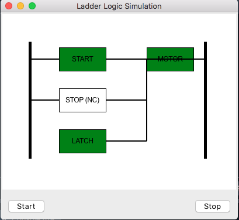

# LadderLogicSimulator-MotorLatch
This is a simple ladder logic simulation built using Python and Tkinter. It visually represents a Start/Stop circuit with latching logic for PLC.

## How It Works
Press "Start" → The motor turns ON and remains ON (latching enabled).
Press "Stop" → The motor turns OFF, breaking the circuit.
The UI updates dynamically to show the current state.

1) LadderLogicSimulator Class
Encapsulates the entire logic:

Initializes the Tkinter window & Canvas.
Draws the ladder logic diagram.
Handles Start & Stop button logic.

2) update_ladder()
Clears and redraws the circuit.
Displays Start, Stop, Latch, and Motor.
